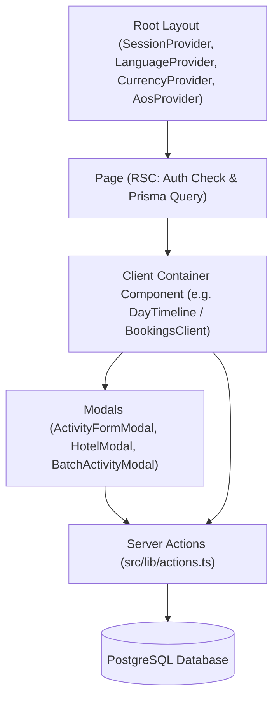

# Architecture & Data Flow

This document details the architectural patterns, state synchronization, client-server boundary management, and rendering considerations for the **Japan Trip Planner**. All internal links use portable relative paths.

---

## 1. Next.js App Router Structure & Boundary Management

The application strictly leverages Next.js 14 App Router conventions:

- **Server Components (RSC)**: 
  - Page entry points (`src/app/trips/[tripId]/page.tsx`, `src/app/trips/[tripId]/days/[slug]/page.tsx`, etc.) are React Server Components.
  - They authenticate sessions via `getAuthSession()` in [src/lib/auth.ts](../../../../src/lib/auth.ts), query PostgreSQL through [src/lib/db.ts](../../../../src/lib/db.ts) (PrismaClient), and serialize data props to client components.
- **Client Components (`"use client"`)**:
  - Interactive leaf components (`TripsListClient.tsx`, `TripOverviewClient.tsx`, `DayTimeline.tsx`, `BookingsClient.tsx`, `SummaryClient.tsx`).
  - Manage user interactions, modal state, optimistic updates, and currency/language contexts.

### Component Hierarchy Diagram



---

## 2. Server Actions & Revalidation

All mutations are implemented in [src/lib/actions.ts](../../../../src/lib/actions.ts).

### Execution Flow:
1. **User Action**: User submits a form or triggers a mutation (e.g., swapping a plan, creating an activity).
2. **Optimistic State (Optional but Recommended)**: The client component immediately updates local React state (`useState`) to give instantaneous feedback.
3. **Server Action Invocation**: Client calls the async action (e.g., `await updateActivity(...)`).
4. **Ownership Verification**: The server action checks session identity against the trip/day/activity owner.
5. **Database Transaction/Update**: Prisma writes the change to PostgreSQL.
6. **Path Revalidation**: `revalidatePath(...)` is invoked on the server.
7. **Transition Refresh**: The client calls:
   ```tsx
   startTransition(() => {
     router.refresh();
   });
   ```
   Wrapping in `startTransition` ensures React keeps the existing UI mounted and interactive while the background RSC payload streams in, avoiding flashes to `loading.tsx`.

---

## 3. Optimistic Updates & Loading Portal Patterns

When operations require noticeable server processing (such as `swapMainPlan`, which updates multiple database records, revalidates paths, and requires a full RSC refetch):

- **Optimistic State**: In [src/components/DayTimeline.tsx](../../../../src/components/DayTimeline.tsx), `localPlans` is stored in state. When swapping, `localPlans` updates immediately, setting `isMain = true` for the chosen plan.
- **Full-Screen Loading Overlay**: To prevent empty layout shifts or card disappearances during the 2-3 second RSC refresh, a portal loading overlay (`isSwapping`) is rendered directly into `document.body` via `createPortal`:
  ```tsx
  {createPortal(
    <div className="fixed inset-0 z-[999999] flex flex-col items-center justify-center bg-slate-950/80 backdrop-blur-md">
      ...
    </div>,
    document.body
  )}
  ```
- **Settling Delay**: A brief buffer (`setTimeout(..., 600)`) is added before releasing the overlay to ensure the server payload has fully painted in the DOM.

---

## 4. AOS (Animate On Scroll) Caveats

AOS is initialized in [src/components/AosProvider.tsx](../../../../src/components/AosProvider.tsx) with `{ once: true, duration: 600 }`.

> [!WARNING]
> Do NOT attach `data-aos` or `data-aos-delay` attributes to dynamically updating list items (such as activity cards, plan tabs, or cost summary stats in [DayTimeline.tsx](../../../../src/components/DayTimeline.tsx)).
> When React re-renders or swaps items in the list, AOS can hide the element or trigger disorienting replay glitches. Static page headers and layout cards can use AOS safely.

---

## 5. Security & Access Control

- Every trip has a `userId` referencing `User.id` in NextAuth.
- Public trips have `isPublic: true`.
- Read access is allowed to anonymous users if `isPublic === true`.
- **Write access is strictly enforced**:
  - `verifyTripOwnership(tripId)`
  - `verifyDayOwnership(dayId)`
  - `verifyActivityOwnership(activityId)`
  If the session user does not match `trip.userId`, the server action throws `"Unauthorized"`.
