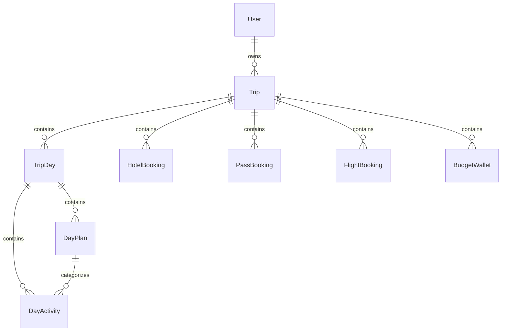

# Database Schema & Server Actions Catalog

This document provides a complete reference for the Prisma data models and the server actions in [src/lib/actions.ts](../../../../src/lib/actions.ts). All internal links use portable relative paths.

---

## 1. Prisma Data Models

The full schema is located at [prisma/schema.prisma](../../../../prisma/schema.prisma).

### Entity Relationship Diagram

### Models Detail

#### 1. `Trip`
- **Fields**: `id`, `userId`, `title`, `startDate`, `endDate`, `description`, `currency` (default "JPY"), `baseCurrency` (default "THB"), `exchangeRate` (Float, default 0.24), `isPublic` (Boolean, default true).
- **Relations**: Cascades to `TripDay`, `HotelBooking`, `PassBooking`, `FlightBooking`, `BudgetWallet`.

#### 2. `TripDay`
- **Fields**: `id`, `tripId`, `dayNumber` (Int, 1-indexed), `date` (DateTime), `dayOfWeek` (String), `slug` (String, e.g. `"day-1-hirosaki"`), `title` (String), `notes` (String?).
- **Relations**: Belongs to `Trip`. Cascades to `DayPlan` and `DayActivity`.

#### 3. `DayPlan` (Substitute Plans System)
- **Fields**: `id`, `dayId`, `title` (e.g. `"Hirosaki Cherry Blossoms"`, `"Indoor Museum Backup"`), `tag` (`"main" | "rainy" | "indoor" | "chill" | "backup" | "custom"`), `isMain` (Boolean, default false), `sortOrder` (Int), `notes` (String?).
- **Rule**: Exactly one plan per `TripDay` has `isMain: true`.
- **Index**: `@@index([dayId, isMain])`.

#### 4. `DayActivity`
- **Fields**: `id`, `dayId`, `planId` (String?, links to `DayPlan`), `time` (String, e.g. `"09:30"`), `location` (String), `activity` (String), `cost` (Float, JPY), `isIcCard` (Boolean), `usingPass` (String?), `remark` (String?), `sortOrder` (Int).
- **Index**: `@@index([planId])`, `@@index([dayId])`.

#### 5. `HotelBooking`
- **Fields**: `id`, `tripId`, `name` (String), `dateRange` (String, legacy), `checkIn` (DateTime?), `checkOut` (DateTime?), `costJpy` (Float?), `costThb` (Float?), `bookingRef` (String?), `notes` (String?).
- **Convention**: Always populate both `checkIn`/`checkOut` and formatted `dateRange`. Use [src/lib/hotelDates.ts](../../../../src/lib/hotelDates.ts).

#### 6. `PassBooking`
- **Fields**: `id`, `tripId`, `name` (e.g. `"JR East-South Hokkaido Rail Pass"`), `costJpy` (Float?), `costThb` (Float?), `validDays` (Int?), `notes` (String?).

#### 7. `FlightBooking`
- **Fields**: `id`, `tripId`, `flightNo` (String), `route` (String, e.g. `"BKK -> HND"`), `departure` (DateTime?), `arrival` (DateTime?), `costJpy` (Float?), `costThb` (Float?), `notes` (String?).

#### 8. `BudgetWallet`
- **Fields**: `id`, `tripId`, `category` (String, e.g. `"IC Card"`, `"Cash / Pocket Money"`, `"Travel Card (Wise)"`), `amountJpy` (Float), `amountThb` (Float), `notes` (String?).

---

## 2. Server Actions Catalog (`src/lib/actions.ts`)

All functions are marked `"use server"` and handle error propagation and path revalidation.

### Ownership Verification Helpers
- `verifyTripOwnership(tripId: string)`: Ensures authenticated user owns the trip.
- `verifyDayOwnership(dayId: string)`: Finds parent trip and checks user ownership.
- `verifyActivityOwnership(activityId: string)`: Finds parent day and trip, checks user ownership.

### Trip Operations
- `createTrip(formData: FormData)`: Calculates day count, generates `TripDay` records with default initial `DayPlan` (`isMain: true`).
- `updateTrip(tripId: string, data: Partial<Trip>)`: Updates title, dates, currencies, rate.
- `deleteTrip(tripId: string)`: Deletes trip and all cascades.
- `toggleTripVisibility(tripId: string, isPublic: boolean)`: Toggles public share link.

### Plan Operations
- `createDayPlan(dayId: string, title: string, tag?: string, notes?: string)`: Adds a new substitute plan (`isMain: false`).
- `updateDayPlan(planId: string, title: string, tag?: string, notes?: string)`: Renames or updates a plan.
- `deleteDayPlan(planId: string)`: Deletes a substitute plan and associated activities. Disallows deleting the main plan.
- `swapMainPlan(dayId: string, newMainPlanId: string)`: Sets the previous main plan to `isMain: false` and `newMainPlanId` to `isMain: true` within a database transaction.

### Activity Operations
- `createActivity(dayId: string, planId: string, data: ActivityInput)`: Creates activity linked to specific plan.
- `updateActivity(activityId: string, data: Partial<ActivityInput>)`: Modifies activity properties.
- `deleteActivity(activityId: string)`: Removes activity.
- `reorderActivities(dayId: string, activityIds: string[])`: Updates `sortOrder` for array of activities.
- `batchCreateActivities(dayId: string, planId: string, activities: ActivityInput[])`: Mass insertion of activities (e.g. from batch modal).

### Logistics Operations
- `createHotel(...)` / `updateHotel(...)` / `deleteHotel(...)`: Hotel CRUD accepting `checkIn`, `checkOut`, `costJpy`, `costThb`.
- `createPass(...)` / `updatePass(...)` / `deletePass(...)`: Transport pass CRUD.
- `createFlight(...)` / `updateFlight(...)` / `deleteFlight(...)`: Flight booking CRUD.
- `createBudgetWallet(...)` / `updateBudgetWallet(...)` / `deleteBudgetWallet(...)`: Budget wallet tracking CRUD.
